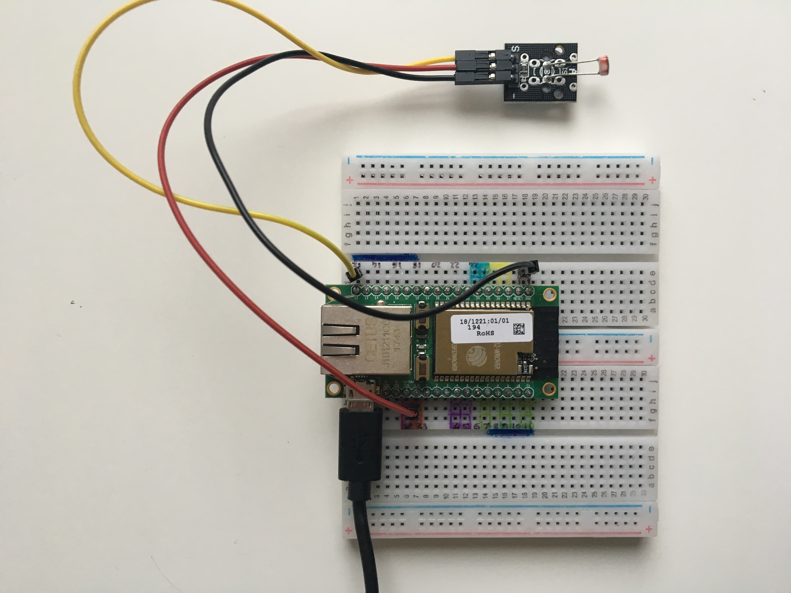
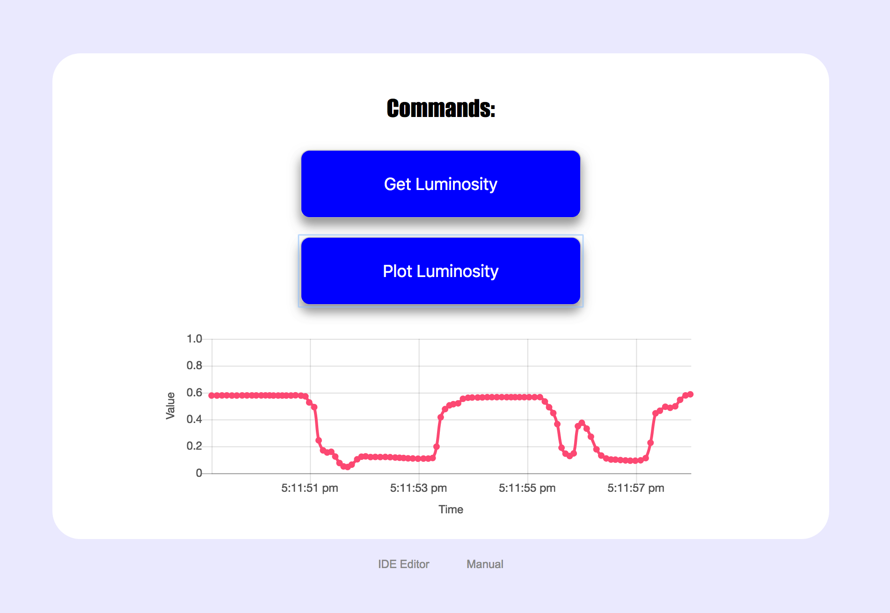

# PhotoResistor Sensor

This is the PhotoResistor Sensor, an example project for the neonious one microcontroller board.

It implements a photoresistor (LDR) , which detects the luminosity and plots it on a graph. You can view the graph through your web browser.

Below is a picture of the photoresistor and neonious circuit:

## Hardware setup

The hardware consists of:

- a neonious one microcontroller board serving the website and controlling and powering the photoresistor. More information about the neonious one board: http://www.neonious.com/
- a photoresistor connected through 3 wires, one for power (pin: 3.3V), one for ground (pin: GND) and one for output (pin: 12 which supports ADC)
- a power supply for the neonious

The photoresistor is the one found in the [Elegoo 37 sensor kit 2.0](https://www.elegoo.com/product/elegoo-upgraded-37-in-1-sensor-modules-kit-v2-0/), the single one is probably the [Keyes KY-018](https://hobbyking.com/en_us/keyes-ky-018-photo-resistor-module-for-arduino.html?countrycode=GB&gclid=CjwKCAiAiJPkBRAuEiwAEDXZZVvc6XYRDjC119exjVaXKBGphm-L4dZhsPj6up8Ck4JsC5H3hmgeoxoCDasQAvD_BwE&gclsrc=aw.ds&___store=en_us). It gives out an analog signal which we can read out easily with the ADC (analog to digital converter) of the board.

## Graph

To view the graph you need to go on the webpage serverd by the neonious (refer to the manual for more information). 

On the webpage you can see two buttons:
- Get Luminosity takes the current value and shows it ona pop up
- Plot Luminosity creates a stream which reads the values at fixed intervals (every 30 milliseconds) and plots them on a graph.